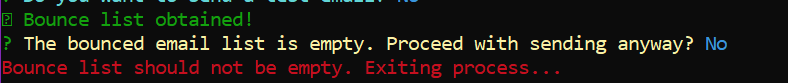

# CLI Steps

This document will explain the steps the tool takes you through to prepare the email blast.

## Environment Variable Validation

The tool will begin by validating your environment variables. If you are missing any of the key variables, the process will log an error and exit. Once all variables are validated, the CLI will prompt for manual confirmation that your "from" address and subject line are accurate. Answering `N` to either of these prompts will terminate the process so you may correct your `.env` values.


## Reading the Body

Within your `emailBody.txt` should be the full contents of the email you want to send. The tool will attempt to read that file. If there are any errors, the tool will log a failure message and terminate the process.

## Test Email

You will be prompted to send a test email. If you choose `N`, the tool will move on to the next step. 

```diff
- NOTE: Skipping the test email is NOT recommended.
```

If you choose `Y`, you will be prompted to provide an email address to send a test message to. The tool will send an email with the body you wrote to that address, then ask you for confirmation that the email is correct. Answering `N` here will terminate the process so you can adjust your email body.


## Bounced Emails

If you confirmed that the test email was correct (or skipped the test email), the tool reads the `bouncedEmails.csv` file to check if you have documented any bouncing email addresses. If there is an error with parsing the file, the tool will log a failure message and exit the process. If the list is empty, the tool will prompt you to confirm that list *should* be empty. Answering `N` here will terminate the process so you can confirm the contents of your file.



## Count Confirmation

The tool will grab the list of valid email addresses from `validEmails.csv`. If it encounters an error during this process, the tool will log a failure message and terminate the process. Otherwise, the tool will prompt you for confirmation that the number of emails to send is correct. This serves as a confirmation that it has read the file correctly. Answering `N` here will end the process.


## Progress

The tool will then log the progress for your email blast.

- `Processed`: This bar tracks the total number of email requests processed, and compares to the total number of emails from the `validEmails.csv` document. The ETA tracks the estimated remaining time until the run is complete.
- `Sent`: This bar tracks the total number of successful send requests, and logs the percentage and total number of successes.
- `Failed`: This bar tracks the total number of send requests that failed due to an error or a non-2XX response from the API. If this number is not 0 when your run completes, see the `Retrying` section below.
- `Skipped`: This bar tracks the total number of send requests that are skipped because the email was present in the `bouncedEmails.csv` file.


## Retrying

In the event that you have failed emails when the script is finished running, you can copy those emails to the valid list and rerun the tool. Use your terminal to call the following commands:

```bash
cp ./prod/failedEmails.csv ./prod/validEmails.csv
npm run start
```
